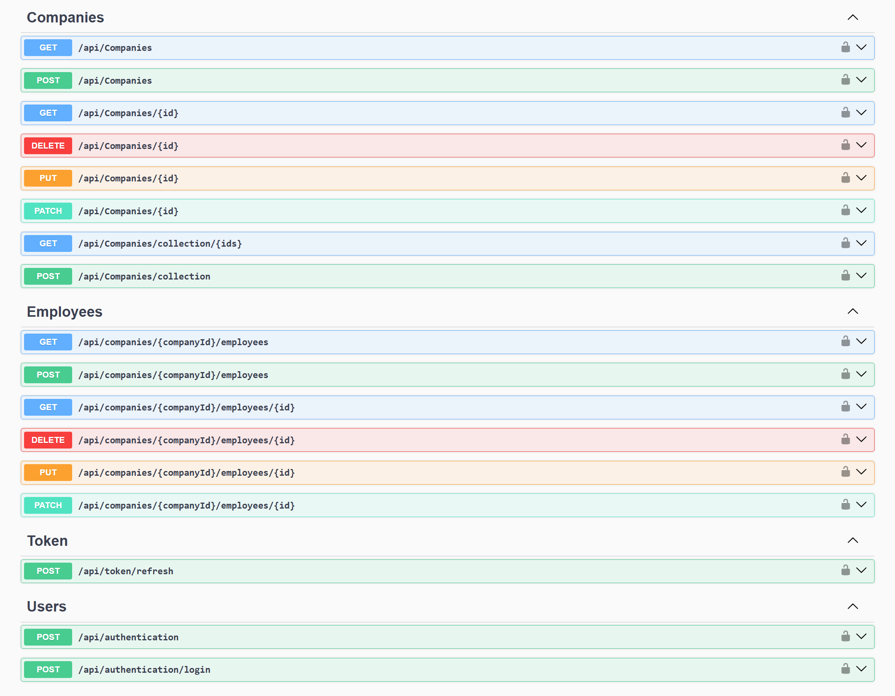

# CompanyEmployees API

CompanyEmployees is a **RESTful Web API** built with **ASP.NET Core**, inspired by the *Ultimate ASP.NET Core Web API* book by CodeMaze, and designed to showcase **professional backend architecture**, **security best practices**, and **clean separation of concerns**.

This project is intended as a **portfolio-grade backend application**, demonstrating how to design a scalable and maintainable API rather than a full-featured HR system.

---

## 📌 Project Overview

CompanyEmployees exposes an API to manage:
- Companies
- Employees (child resources scoped to a company)
- Users with role-based access control

It represents a **company & employee registry**, serving as a solid backend foundation that could later be extended with domain-specific features (HR, payroll, reporting, etc.).

The emphasis of this project is on:
- correctness of API design
- secure authentication and authorization flows
- maintainable architecture
- real-world backend patterns

---

## 🏗️ Architecture

The solution follows **Onion Architecture**, enforcing strict dependency rules and a clear separation of responsibilities.

**Dependency flow:**  
Presentation → Service → Repository → Entities

### Main Layers

- **Entities** — *Domain layer*
  - Domain models
  - Identity models
  - Custom exceptions

- **Repository** — *Infrastructure layer*
  - Data access logic (Entity Framework Core)
  - Query abstraction and persistence

- **Service** — *Application layer*
  - Business rules
  - Authorization logic
  - Transaction orchestration

- **Presentation** — *API layer*
  - Controllers
  - Model binding
  - Filters and HTTP concerns

- **Shared**
  - DTOs
  - Pagination metadata
  - Request features

- **Contracts**
  - Repository interfaces
  - Service and logger abstractions

---

## 🛠️ Tech Stack

- ASP.NET Core Web API
- Entity Framework Core
- SQL Server
- ASP.NET Core Identity
- JWT Authentication with Refresh Tokens
- AutoMapper
- Swagger / OpenAPI
- NLog
- Marvin.Cache.Headers

---

## 🔐 Authentication & Authorization

Authentication is implemented using:
- ASP.NET Core Identity
- JWT access tokens
- Refresh tokens stored server-side (database)

Authorization is **role-based** and enforced at the API level.

### Roles

**Administrator**
- Full system access
- Manage companies
- Manage employees
- Assign managers to companies

**Manager**
- Manage employees
- Logically scoped to a specific company
- No access to company creation or deletion

> Authorization rules are enforced server-side to prevent privilege escalation or client-side manipulation.

---

## 📖 API Documentation (Swagger)

Swagger UI is fully integrated and supports:
- Endpoint discovery
- Request and response schemas
- JWT Bearer authentication

Once the API is running:

https://localhost:5000/swagger

  

---

## 🧪 Status

This project is actively used as a **learning and demonstration platform** and can be extended with additional business logic if required.

---

